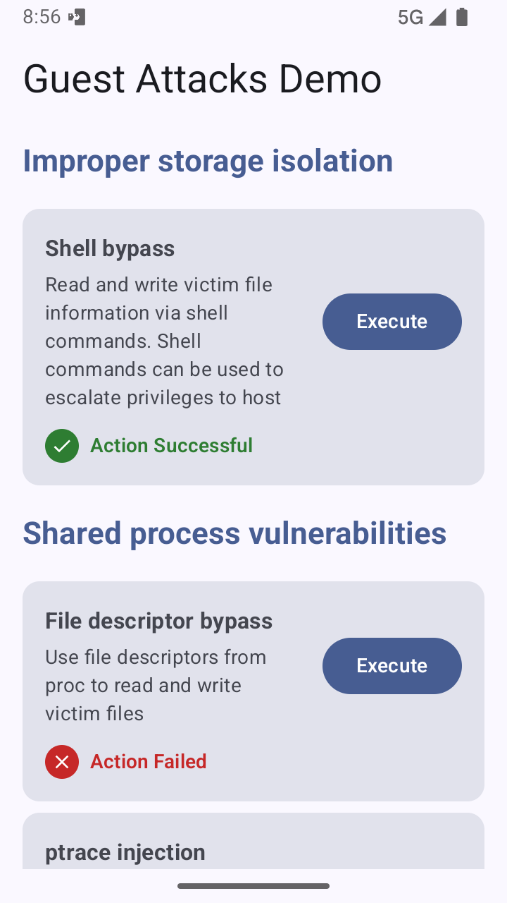

<div align="center">

  # VirtualXposed attack modules

</div>

### Introduction

This repository contains all attack modules used when evaluating the [VirtualXposed](https://github.com/virtuandroid-private/VirtualXposed-private) implementation.
These modules are structured as Legacy Xposed modules written in Kotlin. 
This means that the modules are structured as regular Android apps, with extra metadata to detail how the apps are initialized as Xposed modules.

We use modules in this project to demonstrate malicious behavior which could be embedded within the core virtualization framework.
Instead of embedding the malicious logic within the virtualization framework we use Xposed modules to ensure that the 
virtualization framework can be decoupled from the attacks. This also allows for modularity when deploying multiple attacks.

---

### Building and Installation

Since the modules are Android apps they can be installed within VirtualXposed as normal apps. 
However, once they are installed they need to be enabled within the Xposed Installer app.

To speed up development there are VirtualXposed-specific Gradle tasks which installs the app without any additional confirmation:

For example, to install the network interceptor use this command:
```sh
./gradlew network-interceptor:installToXposed
```
On Windows use the gradlew.bat file instead:
```bat
gradlew.bat network-interceptor:installToXposed
```

The Xposed modules must be explicitly enabled within the Xposed installer settings to function.
This can be verified by opening the module app and verifying that "Loaded status" is set to true.


**NOTE:** VirtualXposed does not always refresh the Xposed modules after installation, it is recommended to force restart the VirtualXposed app after installation.

---

### Xposed Modules

There are currently three Xposed modules: 

#### Fingerprint spoofer

This module demonstrates how the virtualization framework can be used to spoof the device fingerprint visible to virtualized apps.
It hooks the `android.os.Build` class to override static fields such as `Build.FINGERPRINT`, which is used by apps to fingerprint devices.


```sh
./gradlew fingerprint-spoofer:installToXposed
```

#### Network interceptor

This module demonstrates how the virtualization framework can be used to intercept and modify network traffic.
In the demo module we intercept all OkHttp traffic and redirect network calls from the domain example.com to a malicious document.

```sh
./gradlew network-interceptor:installToXposed
```

#### File spoofer

This module demonstrates how the virtualization framework can redirect file access. 
This is accomplished by hooking the File constructor. 
It is not sufficient to hook *all* file usage, but sufficient to demonstrate a proof of concept.
More sophisticated file redirection can be achieved using the existing VirtualXposed [NativeEngine](https://github.com/virtuandroid-private/VirtualXposed-private/blob/master/lib/src/main/java/com/lody/virtual/client/NativeEngine.java).

```sh
./gradlew file-spoofer:installToXposed
```

#### Dynamic code loader

This is both a module and an app to simulate dynamic code loading in modules and apps. It uses the APK file compiled from the `dynamic-code-library` project and a DexClassLoader to dynamically load and execute the code within the APK. The APK file is stored in the assets directory, this is to ease with testing. 
However, the DEX loading system works just as well with a downloaded file.

To demonstrate the capabilities of crafty attackers it also includes an encrypted APK file which is decrypted before execution.

This dynamic code loader executes the `com.virtualxposed.dynamiccode.Sample$init(context: Context)` method, which currently only displays a Toast. This visibly shows when the dynamic code is loaded, as a module or within the sample app.


```sh
./gradlew dynamic-code-loader:installToXposed
```

### Session cloner

This module clones all app data, which lets you clone sessions between virtualized apps. 
To test this module you need an app installed twice within VirtualXposed.

To clone apps within VirtualXposed follow these steps:

1. Long press the launcher
2. Click launcher settings
3. Click "Add app"
4. Select the app to be cloned
5. Click "Install another one"
6. Click "Done"
7. Open "[2] *Cloned app name*"
8. Observe the popup "Copying account data"
9. The cloned app will now launch with the exact same data as the original app

This is best demonstrated within the Victim app which contains a field: "Unique persistent account ID"
which will be identical between cloned instances if this module works.

```sh
./gradlew session-cloner:installToXposed
```

---

### Guest attacker

This repository contains a guest attacker application. This app contains 9 different attacks on other guest apps. It is pre-programmed to only attack the [Victim App](https://github.com/virtuandroid-private/Victim-app-private). Each attack can be executed by pressing a button within the app, and it will display a small popup if the action fails or succeeds. 

The majority of app actions uses various VirtualXposed vulnerabilities to read a private file stored in the victim app private data directory. For example, one action uses [ptrace](https://en.wikipedia.org/wiki/Ptrace) to bypass the IO sandbox by reading the private file as the host process.

Before executing the attacks it is recommended to start the victim app manually, to have it running in the background. This is required for some attacks, such as the attack which reads open file descriptors from the Victim app process.



```sh
./gradlew guest-attacker:installToXposed
```